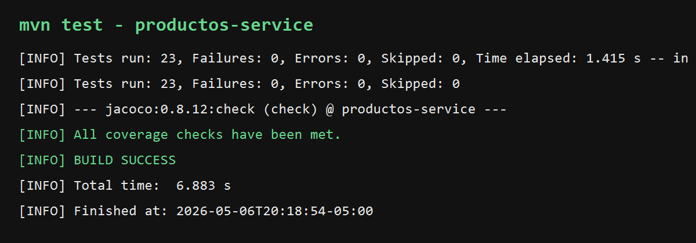

# Vega-post1-u9

Microservicio Spring Boot para gestion de productos, desarrollado para el laboratorio de la Unidad 9: pruebas unitarias y de integracion.

## Proyecto

El codigo fuente esta en `productos-service/` y usa:

- Java 21
- Maven 3.9+
- Spring Boot 3.3.13
- Spring Web
- Spring Data JPA
- H2 Database
- Lombok
- JUnit 5
- Mockito
- JaCoCo

## Estructura

```text
productos-service/
  src/main/java/com/universidad/productosservice/
    ProductosServiceApplication.java
    controller/ProductoController.java
    domain/Producto.java
    repository/ProductoRepository.java
    service/ProductoService.java
    service/ProductoServiceImpl.java
  src/test/java/com/universidad/productosservice/service/
    ProductoServiceImplTest.java
  docs/
    mvn-test-build-success.png
    mvn-test-output.txt
```

## Funcionalidad

El servicio implementa reglas de negocio para:

- Crear productos validando nombre, precio y stock.
- Buscar productos por id.
- Actualizar stock.
- Eliminar productos existentes.

Las validaciones lanzan `IllegalArgumentException` cuando los datos son invalidos y `RuntimeException` cuando el producto no existe.

## Pruebas

La suite `ProductoServiceImplTest` incluye:

- Pruebas con `@Mock` e `@InjectMocks`.
- Casos exitosos para crear y buscar productos.
- Casos negativos con `@ParameterizedTest`, `@NullAndEmptySource`, `@NullSource` y `@ValueSource`.
- Verificacion de no interacciones con el repositorio cuando falla una validacion.
- `ArgumentCaptor` para validar que el nombre se normaliza con `strip()` antes de persistir.
- Verificacion de llamadas exactas a `findById`, `save` y `deleteById`.

## Ejecucion

Desde la carpeta del servicio:

```bash
cd productos-service
mvn test
```

El comando ejecuta la suite completa y genera el reporte JaCoCo en:

```text
productos-service/target/site/jacoco/index.html
```

JaCoCo valida por build que la capa `com.universidad.productosservice.service` tenga al menos 70% de cobertura. En la ejecucion actual, `ProductoServiceImpl` quedo con 100% de lineas cubiertas.

## Evidencia



Resumen de la ultima ejecucion:

```text
Tests run: 23, Failures: 0, Errors: 0, Skipped: 0
All coverage checks have been met.
BUILD SUCCESS
```
